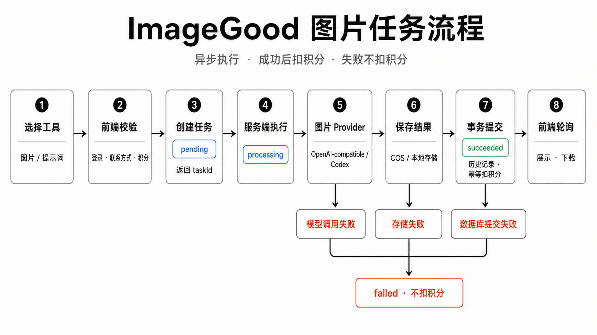
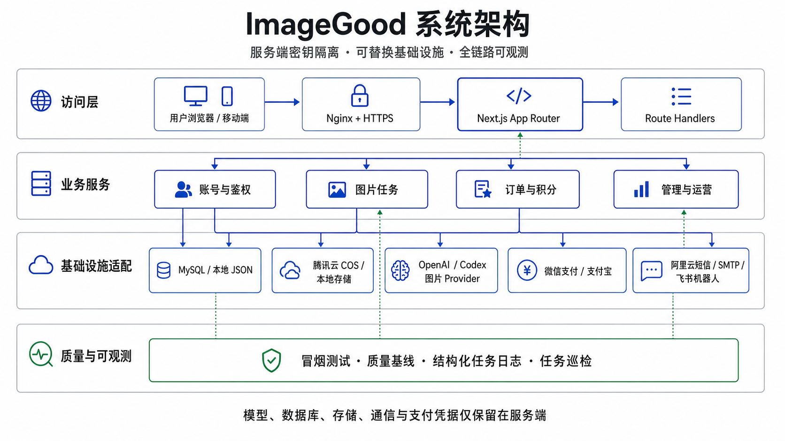

<div align="center">

# ImageGood

**面向内容创作者、商家与普通用户的 AI 图片创作与处理平台**

[](https://github.com/Xiaokang-Xue/ImageGood/actions/workflows/ci.yml)
[](https://github.com/Xiaokang-Xue/ImageGood/releases)
[](https://nextjs.org/)
[](LICENSE)

[在线体验](https://imagegood.net) · [English](README_EN.md) · [配置文档](docs/configuration.md) · [参与贡献](CONTRIBUTING.md)

</div>

<div align="center">
  
</div>

## 项目简介

ImageGood 支持上传图片或输入文字完成 AI 修图、文生图、智能抠图、图片增强、去杂物、商品图和封面海报生成。图片任务由服务端异步执行：前端通过 `taskId` 轮询状态，任务成功并保存结果后写入历史记录、扣除积分，失败不扣积分。

仓库同时包含账号认证、积分与订单、微信和支付宝支付适配、腾讯云 COS、本地存储、运营后台及任务巡检等产品化基础设施。真实图片、短信、邮件和支付能力需要对应服务凭据；本地可使用 mock 模式启动。

## 为什么选择 ImageGood

| 特性 | 设计重点 |
| --- | --- |
| 完整业务闭环 | 账号、图片任务、积分、支付、对象存储、历史记录和运营后台位于同一套应用中。 |
| 可靠任务语义 | 异步状态轮询；结果保存成功后再扣积分；失败不扣积分；支付回调采用幂等到账逻辑。 |
| 可替换基础设施 | 图片 Provider 支持 OpenAI-compatible API、Codex 和 mock；数据层支持 MySQL / 本地 JSON；存储支持 COS / 本地文件。 |
| 可运营与可观测 | 提供冒烟测试、页面质量基线、图片任务耗时与成功率巡检，以及结构化任务日志。 |

## 核心能力

状态说明：`Stable` 表示仓库中已有稳定入口和业务链路；`Optional` 表示可按需启用；`Experimental` 表示结果能力仍受所选 Provider 影响；`Requires external credentials` 表示真实运行需要外部服务资质或密钥。

| 模块 | 能力 | 状态 |
| --- | --- | --- |
| 图片创作 | AI 修图、文生图、图片增强、去杂物、商品图、封面海报 | Stable · Requires external credentials |
| 智能抠图 | 透明 PNG 与纯色背景结果处理 | Experimental · Requires external credentials |
| 用户与认证 | 手机号验证码 / 密码登录、邮箱注册验证、密码找回、httpOnly Cookie 会话 | Stable；短信与邮件为 Optional · Requires external credentials |
| 积分和支付 | 积分套餐、积分流水、微信支付 APIv3、支付宝电脑网站支付 | Optional · Requires external credentials |
| 历史记录 | 任务分页、详情、下载、单条与批量删除 | Stable |
| 管理后台 | 订单管理、运营数据、转化漏斗、来源反馈 | Stable |
| 存储 | 本地文件、腾讯云 COS 与受保护图片代理 | Stable；COS 为 Optional · Requires external credentials |
| 可观测性 | 冒烟测试、质量基线、结构化任务日志、任务巡检、飞书日报 | Stable；飞书为 Optional · Requires external credentials |

## 产品演示

线上环境可访问 [imagegood.net](https://imagegood.net)。仓库截图仅用于展示当前首页；真实生成效果取决于部署时选择的图片 Provider、模型能力和输入素材。

## 图片任务流程



可维护源码：[docs/diagrams/image-task-flow.mmd](docs/diagrams/image-task-flow.mmd)。任务创建后立即返回 `taskId`；模型、存储或数据库提交任一环节失败，任务进入 `failed` 且不扣积分。

## 系统架构



可维护源码：[docs/diagrams/system-architecture.mmd](docs/diagrams/system-architecture.mmd)。浏览器只访问 Next.js 页面和 Route Handlers，模型、数据库、COS、通信与支付凭据均保留在服务端。

## 快速开始

建议使用 Node.js 20 LTS。以下配置不调用真实模型、对象存储或支付平台。

```bash
git clone https://github.com/Xiaokang-Xue/ImageGood.git
cd ImageGood
npm install
cp .env.example .env.local
```

将 `.env.local` 调整为最小 mock 配置：

```env
NEXT_PUBLIC_APP_URL=http://localhost:3000
AUTH_SECRET=replace-with-a-long-random-string
AUTH_COOKIE_SECURE=false
DATABASE_URL=file:./dev.db
IMAGE_API_MODE=mock
IMAGE_STORAGE_PROVIDER=local
PAYMENT_MODE=mock
```

```bash
npm run db:push
npm run dev
```

访问 [http://localhost:3000](http://localhost:3000)。真实 Provider、MySQL、COS、短信、邮件与支付配置见 [配置文档](docs/configuration.md)。

## 运行模式

| 模式 | 图片生成 | 数据与图片 | 支付 | 外部凭据 |
| --- | --- | --- | --- | --- |
| 本地体验 | mock Provider | 本地 JSON + 本地文件 | mock | 无；短信、邮件等外部集成不可用 |
| 完整生产 | OpenAI-compatible API 或 Codex | MySQL + 腾讯云 COS | 微信支付 / 支付宝 | Provider、数据库、COS、支付、短信和邮件等对应凭据 |

生产部署还应配置公网 HTTPS、强随机 `AUTH_SECRET`、安全 Cookie、支付回调地址和进程管理。完整环境变量及启用条件以 [.env.example](.env.example) 和 [docs/configuration.md](docs/configuration.md) 为准。

## 自动化检查

```bash
npm run lint
npx tsc --noEmit
npm run build
```

启动本地服务后，可运行不生成图片、不创建订单的核心冒烟测试：

```bash
npm run test:smoke
```

其他只读或运维检查：

```bash
npm run ops:quality-baseline
npm run ops:task-audit
npm run ops:daily-report
```

任务巡检和飞书日报会读取对应数据库或机器人配置，不属于无凭据的本地检查。详见 [冒烟测试](docs/smoke-testing.md)、[质量基线](docs/quality-baseline.md) 和 [任务可观测性](docs/image-task-observability.md)。

## 项目结构

```text
ImageGood/
├── src/app/                 # App Router 页面与 Route Handlers
├── src/components/          # 页面、工作台与通用 UI 组件
├── src/lib/                 # 账号、数据、任务、存储、支付与运营服务
├── src/types/               # 共享 TypeScript 类型
├── scripts/                 # 数据初始化、冒烟测试、基线与巡检脚本
├── server/                  # 可选的 Python Codex 图片服务
├── docs/                    # 配置、运维、图示源码与产品截图
├── public/                  # 静态资源
└── .github/                 # CI、依赖更新、Issue 与 PR 模板
```

## 文档

- [环境变量与运行配置](docs/configuration.md)
- [核心功能冒烟测试](docs/smoke-testing.md)
- [图片任务可观测性](docs/image-task-observability.md)
- [页面质量基线](docs/quality-baseline.md)
- [Codex 服务部署](docs/deploy-codex-server.md)
- [贡献指南](CONTRIBUTING.md)
- [支持说明](SUPPORT.md)
- [安全策略](SECURITY.md)

## Roadmap

短期与候选方向见 [ROADMAP.md](ROADMAP.md)。路线图不承诺固定发布日期，发布记录以 [GitHub Releases](https://github.com/Xiaokang-Xue/ImageGood/releases) 和 [CHANGELOG.md](CHANGELOG.md) 为准。

## 参与贡献

提交代码前请阅读 [CONTRIBUTING.md](CONTRIBUTING.md) 与 [CODE_OF_CONDUCT.md](CODE_OF_CONDUCT.md)。Issue 和 Pull Request 中不得包含密钥、证书、用户图片、手机号、邮箱、订单信息或生产数据库内容。

## 安全说明

不要在公开 Issue 中披露未修复漏洞。报告方式、支持版本和密钥泄露处置要求见 [SECURITY.md](SECURITY.md)。

## License

Copyright (c) 2026 ImageGood. All rights reserved. 详见 [LICENSE](LICENSE)。
