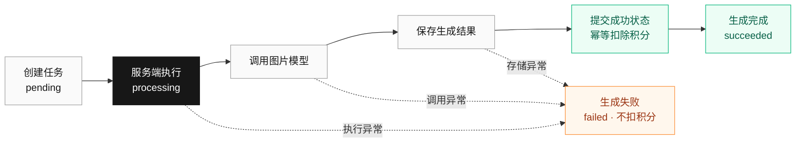
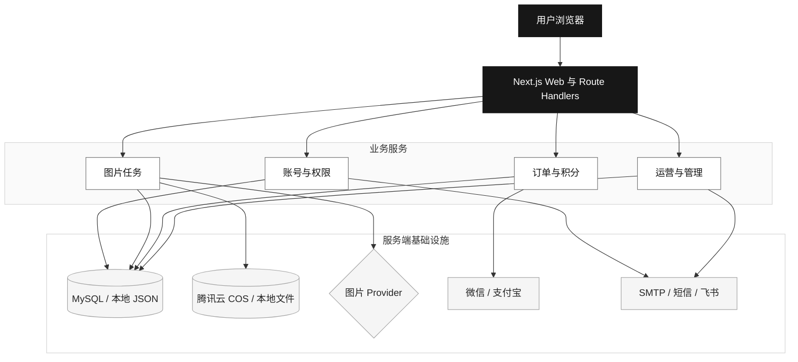

<div align="center">

# ImageGood

**面向内容创作者、商家与普通用户的 AI 图片创作与处理平台**

[](https://nextjs.org/)
[](https://react.dev/)
[](https://www.typescriptlang.org/)
[](https://imagegood.net)
[](#license)

[在线体验](https://imagegood.net) · [快速开始](#快速开始) · [配置说明](docs/configuration.md) · [任务排障](docs/image-task-observability.md)

</div>

<div align="center">
  
</div>

ImageGood 支持上传图片或输入文字完成 AI 修图、文生图、智能抠图、图片增强、去杂物、商品图和封面海报生成。图片任务由服务端异步执行，成功后保存结果、写入历史记录并扣除积分，失败不扣积分。

## 核心功能

| 能力 | 说明 |
| --- | --- |
| AI 修图 | 上传图片，用自然语言描述修改需求 |
| 文生图 | 根据文字描述生成创意图片 |
| 智能抠图 | 输出透明 PNG，并支持白底、黑底和自定义纯色背景 |
| 图片增强 | 改善清晰度、细节和整体观感 |
| 去杂物 | 通过文字说明移除路人、杂物和干扰元素 |
| 商品图 | 围绕商品主体生成营销场景图 |
| 封面海报 | 生成适用于内容平台和宣传场景的封面视觉 |

平台同时提供：

- 手机号验证码 / 密码登录，邮箱注册、验证与密码找回。
- httpOnly Cookie 会话、密码哈希、验证码限流和接口鉴权。
- 异步任务轮询、结果持久化、历史记录查看与批量删除。
- 积分套餐、积分流水、微信支付和支付宝支付。
- 腾讯云 COS 图片存储，以及本地文件存储模式。
- 管理员订单后台、运营看板、转化漏斗和飞书日报。

## 任务流程



前端创建任务后立即获得 `taskId`，再轮询任务状态。模型调用、结果存储、数据库更新和积分扣减均以同一 `taskId` 记录结构化日志。

## 系统架构



浏览器只访问 Next.js API。模型密钥、数据库连接、COS 凭据、短信、邮件和支付签名均保留在服务端。

## 技术栈

| 层级 | 技术 |
| --- | --- |
| Web | Next.js 14 App Router、React 18、TypeScript |
| UI | Tailwind CSS、Lucide React、Zustand |
| 数据 | 项目内置数据层、本地 JSON 或 MySQL |
| 图片 | OpenAI SDK、OpenAI-compatible Images API、可选 Codex 服务 |
| 存储 | 腾讯云 COS 或本地文件 |
| 通信 | SMTP、阿里云短信、飞书机器人 |
| 支付 | 微信支付 APIv3、支付宝电脑网站支付 |

## 快速开始

推荐使用 Node.js 20 LTS。

```bash
git clone https://github.com/Xiaokang-Xue/ImageGood.git
cd ImageGood
npm install
cp .env.example .env.local
```

最小本地配置：

```env
NEXT_PUBLIC_APP_URL=http://localhost:3000
AUTH_SECRET=请替换为高强度随机字符串
AUTH_COOKIE_SECURE=false
DATABASE_URL=file:./dev.db

IMAGE_API_MODE=mock
IMAGE_STORAGE_PROVIDER=local
PAYMENT_MODE=mock
```

初始化并启动：

```bash
npm run db:push
npm run dev
```

访问 `http://localhost:3000`。真实模型、MySQL、COS、短信、邮件和支付配置见 [配置说明](docs/configuration.md) 与 [.env.example](.env.example)。

## 生产部署

当前服务器目录示例为 `/data/Photoshop`：

```bash
cd /data/Photoshop
npm ci
test -f .env.local || cp .env.example .env.local
npm run db:push
npm run build
npm run start -- -H 0.0.0.0
```

生产环境建议使用 MySQL、腾讯云 COS、Nginx、HTTPS 和进程管理工具。更新代码后：

- `package.json` 或 `package-lock.json` 有变化时重新执行 `npm ci`。
- 业务源码有变化时重新构建并重启网站进程。
- `.env.local`、数据库、图片目录和支付证书不要被代码压缩包覆盖。
- 支付回调必须使用公网可访问的 HTTPS 地址。

## 自动化检查

```bash
# 代码质量
npm run lint
npx tsc --noEmit

# 核心页面、公开接口和权限边界，不生成图片或订单
npm run test:smoke -- --base-url=https://imagegood.net

# 页面性能与可用性基线
npm run ops:quality-baseline

# 最近 24 小时图片任务巡检，需要能够访问数据库
npm run ops:task-audit

# 手动发送飞书运营日报
npm run ops:daily-report
```

## 文档

- [环境变量与部署配置](docs/configuration.md)
- [核心功能自动化冒烟测试](docs/smoke-testing.md)
- [图片生成任务可观测性](docs/image-task-observability.md)
- [质量基线](docs/quality-baseline.md)
- [Codex 服务部署](docs/deploy-codex-server.md)

## 安全说明

- 不要提交 `.env.local`、API Key、Webhook、数据库密码或 COS 密钥。
- 不要提交 `.pem`、支付私钥和平台证书。
- 生产环境必须启用 HTTPS、安全 Cookie，并设置高强度 `AUTH_SECRET`。
- 支付到账只以服务端异步通知验签结果为准。
- 用户任务、订单和管理员接口必须在服务端鉴权。

## License

Copyright (c) 2026 ImageGood. All rights reserved.
